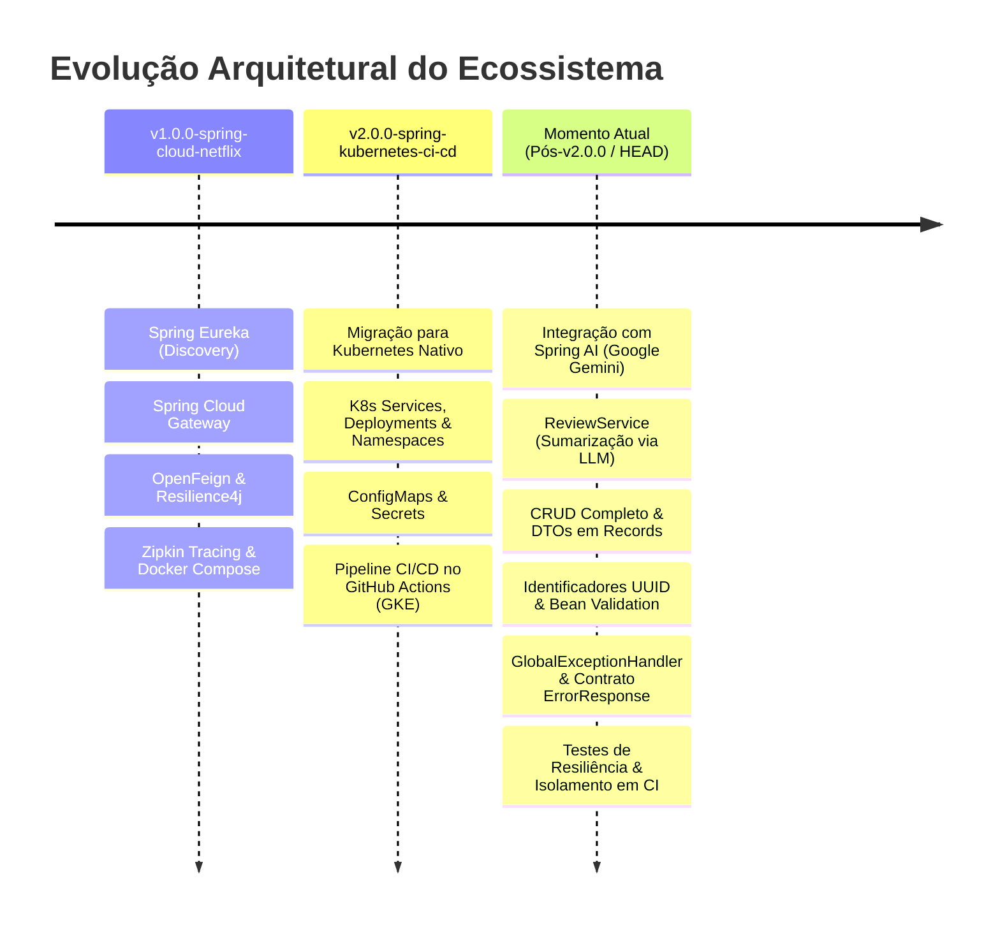
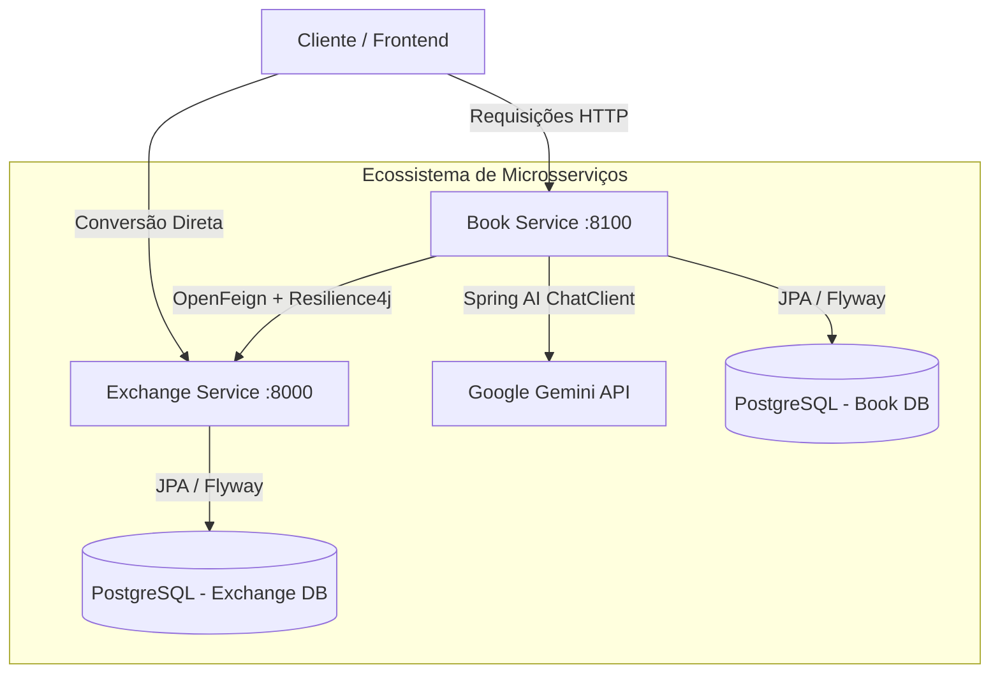

# Microservices Ecosystem — Spring Cloud, Kubernetes & Spring AI


Ecossistema de microsserviços em **Java / Spring Boot** que demonstra a evolução contínua de uma arquitetura distribuída: desde a stack tradicional com **Spring Cloud Netflix**, passando pela migração para **Kubernetes & CI/CD no Google Kubernetes Engine (GKE)**, até a maturidade atual com integração de **IA Generativa (Spring AI)**, CRUD REST completo com DTOs, tratamento global de erros e suíte avançada de testes e resiliência.

---

## 📜 Linha do Tempo e Evolução do Projeto

Este repositório foi construído de forma incremental, onde cada marco representa um momento chave de modernização arquitetural e aplicação de novos conceitos:



### 1️⃣ Release `v1.0.0-spring-cloud-netflix` — Stack Spring Cloud Tradicional
- **Service Discovery & Routing:** Utilização do **Netflix Eureka Server** (porta 8761) e **Spring Cloud Gateway** (porta 8765) como ponto único de entrada e roteamento dinâmico.
- **Comunicação Inter-serviços:** **OpenFeign** para chamadas síncronas declarativas entre o `book-service` e o `exchange-service`.
- **Resiliência:** **Resilience4j** implementando Circuit Breaker, Retry e Rate Limiter nas consultas cambiais.
- **Observabilidade:** Rastreamento distribuído com **Micrometer Tracing** e exportação de traces para o **OpenZipkin** (porta 9411).
- **Infraestrutura Local:** Orquestração completa dos serviços e banco PostgreSQL via Docker Compose.

### 2️⃣ Release `v2.0.0-spring-kubernetes-ci-cd` — Migração Cloud Native (Kubernetes & CI/CD)
- **Eliminação de Componentes Legados:** Remoção da dependência do Eureka e do Spring Cloud Gateway, delegando a descoberta de serviços e balanceamento de carga para **Services nativos do Kubernetes** (`ClusterIP` / `LoadBalancer`).
- **Configuração Declarativa K8s:** Criação de manifestos (`Deployments`, `Services`, `ConfigMaps` e `Secrets`) isolados no namespace `microservices`.
- **Probes de Confiabilidade:** Configuração de `startupProbe`, `livenessProbe` e `readinessProbe` integrados ao Spring Boot Actuator.
- **Automação de CI/CD (GitHub Actions):** Pipeline reutilizável (`template-ci-cd.yml`) com execução de testes automatizados, build e publicação de imagens no Docker Hub e deploy automatizado no **Google Kubernetes Engine (GKE)** via Workload Identity / Service Account.

### 3️⃣ Momento Atual (Pós-v2.0.0 / HEAD) — Spring AI, Maturidade REST & Qualidade Enterprise
- **Integração com Spring AI & IA Generativa:**
  - Adição do módulo `spring-ai-starter-model-google-genai` no `book-service`.
  - Criação do `ReviewService` que utiliza o modelo **Google Gemini** (`gemini-3.5-flash-lite`) para gerar automaticamente um resumo objetivo e conciso do livro em português durante o cadastro.
  - Resiliência dedicada para o LLM (`@Retry`, `@CircuitBreaker` com fallback e `@RateLimiter`) garantindo que o cadastro de livros não seja bloqueado por indisponibilidade da IA.
- **Evolução da API REST & Camada de DTOs:**
  - Expansão do `book-service` para suporte a um **CRUD completo** (`POST`, `GET` todos com projeção, `GET` por ID com e sem conversão, `PUT`, `DELETE`).
  - Utilização de **Java Records** como DTOs de entrada e resposta (`BookRecordDto`, `BookIndexResponse`, `BookShowResponse`).
  - Identificadores únicos padronizados com **UUID**.
  - Versionamento explícito de endpoints (`version = "v1"`).
- **Padronização de Erros & Validação:**
  - Centralização de tratamento de erros com `@RestControllerAdvice` (`GlobalExceptionHandler`) em ambos os microsserviços.
  - Contrato uniforme de resposta de erro (`ErrorResponse`) contendo timestamp, status HTTP, mensagem amigável e detalhes de validação.
  - Validação declarativa rigorosa com **Jakarta Validation** (`@Valid`, `@NotBlank`, `@NotNull`, `@PositiveOrZero`, `@Size`, `@Min`, `@Max`).
- **Engenharia de Testes & Isolamento de Ambientes:**
  - Testes unitários para regras de negócio (`BookServiceTest`, `ExchangeServiceTest`).
  - Suíte dedicada de testes de resiliência (`BookServiceResilienceTest`) validando estados do Circuit Breaker, retentativas e limites de taxa.
  - Perfil de testes isolado (`application-test.yml`) e variáveis específicas (`BOOK_DATASOURCE_URL_TEST`, `EXCHANGE_DATASOURCE_URL_TEST`) integradas ao pipeline de CI.

---

## 🏗️ Arquitetura Atual



### Serviços

1. **Book Service (Porta `8100`):**
   - Gestão completa do ciclo de vida de livros (CRUD).
   - Consulta de livros com conversão de preços para qualquer moeda solicitada via integração com o `exchange-service`.
   - Geração automática de resumos e avaliações via **Google Gemini (Spring AI)**.
   - Protegido por Circuit Breaker, Retry e Rate Limiter (Resilience4j).

2. **Exchange Service (Porta `8000`):**
   - Gestão das taxas de câmbio entre diferentes pares de moedas (ex: USD para BRL, EUR, etc.).
   - Cálculo do fator de conversão cambial com base nos registros mantidos em banco de dados.

---

## 🛠️ Tecnologias Utilizadas

| Categoria | Tecnologias |
|---|---|
| **Linguagem & Framework** | Java 21, Spring Boot 4.1.0 / 3.4.x |
| **Inteligência Artificial** | Spring AI 2.0.x, Google GenAI Starter (`gemini-3.5-flash-lite`) |
| **Comunicação & Resiliência** | Spring Cloud OpenFeign, Resilience4j (Circuit Breaker, Retry, Rate Limiter) |
| **Banco de Dados & Migração** | PostgreSQL, Flyway Migration |
| **Documentação da API** | SpringDoc OpenAPI 3, Swagger UI |
| **Validação & Utilitários** | Jakarta Bean Validation, Jackson |
| **Testes Automatizados** | JUnit 5, Mockito, AssertJ, Spring Boot Test |
| **Container & Orquestração** | Docker, Docker Compose, Kubernetes (K8s) |
| **CI/CD & Cloud** | GitHub Actions, Google Kubernetes Engine (GKE), Docker Hub |

---

## 📡 Endpoints da API

### 📚 Book Service (`http://localhost:8100/books`)

| Método | Rota | Descrição |
|---|---|---|
| `POST` | `/books` | Cria um novo livro e gera automaticamente um resumo via Spring AI |
| `GET` | `/books` | Lista todos os livros cadastrados (com projeção resumida `BookIndexResponse`) |
| `GET` | `/books/{id}` | Busca os detalhes completos de um livro por UUID |
| `GET` | `/books/{id}/{currency}` | Busca o livro e converte o preço para a moeda desejada via `exchange-service` |
| `PUT` | `/books/{id}` | Atualiza os dados de um livro existente |
| `DELETE` | `/books/{id}` | Remove um livro pelo seu UUID |

<details>
<summary><b>Exemplo de Payload para Cadastro (<code>POST /books</code>)</b></summary>

```json
{
  "title": "Clean Code",
  "author": "Robert C. Martin",
  "publisher": "Prentice Hall",
  "publicationYear": 2008,
  "price": 150.00
}
```

**Resposta (`201 Created`):**
```json
{
  "id": "e2f1a6c4-1234-4a5b-9c8d-7e6f5a4b3c2d",
  "title": "Clean Code",
  "author": "Robert C. Martin",
  "publisher": "Prentice Hall",
  "publicationYear": 2008,
  "price": 150.00,
  "review": "Clean Code apresenta princípios e práticas essenciais para escrever código legível, manutenível e eficiente...",
  "currency": "USD",
  "environment": null
}
```
</details>

<details>
<summary><b>Exemplo de Busca com Conversão Cambial (<code>GET /books/{id}/BRL</code>)</b></summary>

```json
{
  "id": "e2f1a6c4-1234-4a5b-9c8d-7e6f5a4b3c2d",
  "title": "Clean Code",
  "author": "Robert C. Martin",
  "publisher": "Prentice Hall",
  "publicationYear": 2008,
  "price": 750.00,
  "review": "Clean Code apresenta princípios...",
  "currency": "BRL",
  "environment": "Book-service HOST: LOCAL PORT: 8100 exchange-service HOST: 8000"
}
```
</details>

---

### 💱 Exchange Service (`http://localhost:8000/exchange-service`)

| Método | Rota | Descrição |
|---|---|---|
| `GET` | `/exchange-service/{value}/{from}/{to}` | Realiza a conversão de um valor entre duas moedas |

<details>
<summary><b>Exemplo de Conversão (<code>GET /exchange-service/100/USD/BRL</code>)</b></summary>

```json
{
  "id": 1,
  "from": "USD",
  "to": "BRL",
  "conversionFactor": 5.00,
  "convertedValue": 500.00,
  "environment": "8000"
}
```
</details>

---

## 🛡️ Resiliência e Tolerância a Falhas

O ecossistema utiliza o **Resilience4j** para blindar os serviços contra falhas em cascata e degradação de desempenho:

### 1. Comunicação `Book Service` ➡️ `Exchange Service`
- **Circuit Breaker:** Monitora uma janela de 10 chamadas. Caso a taxa de erro atinja 50%, o circuito abre por 10 segundos, ativando imediatamente o método de fallback (retorna o preço original em moeda padrão informando o estado no payload).
- **Retry:** Realiza até 3 tentativas automáticas com intervalo de 1s antes de propagar o erro para o fallback.
- **Rate Limiter:** Limita o tráfego a 10 requisições por segundo.

### 2. Chamadas ao LLM (`ReviewService` ➡️ `Google Gemini`)
- **Circuit Breaker & Fallback:** Se a API de IA exceder a taxa de erros ou ficar indisponível, o fallback é acionado gravando o livro normalmente com `review: null`, sem interromper a criação do registro.
- **Retry:** Até 3 tentativas automáticas em caso de instabilidades transitórias de rede.
- **Rate Limiter:** Limitado a 5 requisições por segundo para respeitar a cota da API da Google GenAI.

---

## 🤖 Swagger & Documentação Interativa

Com as aplicações em execução, as interfaces do Swagger UI ficam acessíveis em:
- **Book Service:** `http://localhost:8100/swagger-ui.html`
- **Exchange Service:** `http://localhost:8000/swagger-ui.html`

---

## 🚀 Como Executar

### Pré-requisitos
- **Java 21** e **Maven 3.9+**
- **Docker** e **Docker Compose**
- **Chave de API do Google Gemini** (Google GenAI) para os resumos com IA
- *(Opcional)* Cluster Kubernetes (`Minikube`, `Kind` ou `GKE`) e `kubectl`

---

### Passo 1: Configuração das Variáveis de Ambiente

Crie o arquivo `.env` dentro de cada serviço conforme os exemplos fornecidos:

1. **`book-service/.env`**:
   ```properties
   GOOGLE_GENAI_APIKEY=sua_chave_gemini_aqui
   DATASOURCE_URL=jdbc:postgresql://localhost:5432/book_service
   DATASOURCE_USER=postgres
   DATASOURCE_PASSWORD=admin
   ```

2. **`exchange-service/.env`**:
   ```properties
   DATASOURCE_URL=jdbc:postgresql://localhost:5432/exchange_service
   DATASOURCE_USER=postgres
   DATASOURCE_PASSWORD=admin
   ```

---

### Passo 2: Execução com Docker Compose (Recomendado para Dev Local)

1. Suba os bancos de dados e serviços:
   ```bash
   docker-compose up -d
   ```
2. As migrações do Flyway serão executadas automaticamente ao inicializar cada serviço.
3. Os serviços estarão disponíveis em:
   - Book Service: `http://localhost:8100`
   - Exchange Service: `http://localhost:8000`

---

### Passo 3: Execução Manual dos Microsserviços

Se preferir rodar localmente via Maven:

1. Inicie o PostgreSQL (ou suba apenas o banco via Docker).
2. Em um terminal, inicie o `exchange-service`:
   ```bash
   cd exchange-service
   ./mvnw spring-boot:run
   ```
3. Em outro terminal, inicie o `book-service`:
   ```bash
   cd book-service
   ./mvnw spring-boot:run
   ```

---

### Passo 4: Execução no Kubernetes (K8s)

Para executar o cluster local ou no GKE:

1. Aplique os manifestos do `exchange-service`:
   ```bash
   kubectl apply -f exchange-service/k8s/
   ```
2. Aplique os manifestos do `book-service`:
   ```bash
   kubectl apply -f book-service/k8s/
   ```

---

## 🧪 Testes Automatizados

O projeto possui suítes completas de testes unitários, testes de integração de regras de negócio e testes específicos de resiliência:

```bash
# Executar todos os testes no book-service
cd book-service
./mvnw clean test

# Executar todos os testes no exchange-service
cd exchange-service
./mvnw clean test
```

### Destaques dos Testes:
- **`BookServiceResilienceTest`:** Valida o comportamento do Circuit Breaker em estados OPEN/CLOSED, acionamento do fallback, execução de retentativas e bloqueio pelo Rate Limiter.
- **`GlobalExceptionHandlerTest`:** Garante conformidade de status HTTP e payloads de erro para validações, entidades não encontradas e exceções genéricas.
